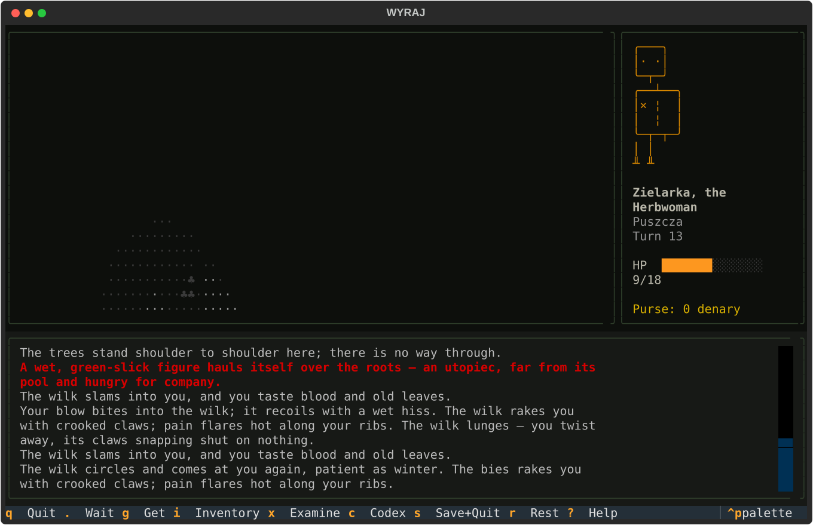

# Wyraj

A **narrated roguelike** set in Slavic dark fantasy. Procedural world,
permadeath, turn-based tactics — and a narration engine that turns every
mechanical event into readable folk-horror prose. No goblins, no orcs:
leszy, strzyga, utopiec, bies, licho.

> *Wyraj* — the Slavic otherworld where souls fly as birds and return in spring.



## What makes it different

- **Read the log like a story.** Events carry facts; a template narration
  engine with context tags (wounds, darkness, recency) composes each turn
  into a paragraph of prose. Meet a strzyga and you'll know it.
- **Slavic folklore played straight** — bestiary, remedies (odwar,
  gromnica, sól święcona), story hooks, and village rumors, all data-driven
  YAML.
- **A world with a shape:** the wieś (rest, barter, rumors) → the puszcza →
  the bagna, where utopce swim → three levels of kurhany crypts, dark
  unless your thunder-candle burns.
- **Deterministic to the bone.** Same seed, same run — golden-transcript
  tested. Saves restore RNG streams bit-exactly and are consumed on load;
  permadeath writes you a morgue file.
- **Powroty: what was carried to Wyraj comes back.** Everything on the
  body is lost — but the skrzynia keeps its heirlooms, silver banks in
  the wieś, the codex remembers what killed you, an uncanny dziad in the
  depths remembers *you*, and some deaths unlock new beginnings.
- **Fully bilingual.** `--lang pl` switches to natively authored Polish
  narration — real case declension (*strzygę, strzygą, strzydze*) via
  per-noun form tables, never machine-mapped from English.

## Play

```sh
uv sync
uv run wyraj                 # title screen: new journey, continue, codex, morgue
uv run wyraj --seed 42       # deterministic fresh run
uv run wyraj --origin zielarka
uv run wyraj --lang pl        # cała narracja po polsku
uv run wyraj --history       # your past deaths, remembered
uv run wyraj --ascii         # CP437-safe glyphs
uv run wyraj --portrait half # halfblock portrait (default: box-drawing)
uv run wyraj --narrator llm  # optional local-LLM narration (Ollama; off by default)
```

Keys: `hjkl`/`yubn`/arrows move (bump to attack — or to talk, in the
village), `.` wait, `g` get, `i` inventory, `x` examine, `c` codex,
`>`/`<` stairs, `r` rest (village), `s` save+quit, `q` quit.

Config file: `~/.wyraj/config.yml` (`ascii`, `portrait`, `origin`, `lang`, `narrator`, `llm`).

## Develop

```sh
uv run pytest              # tests (incl. golden-run transcript)
uv run ruff check .        # lint
uv run mypy                # strict on core/ and narration/
```

Docs: [architecture](docs/ARCHITECTURE.md) ·
[authoring content](docs/CONTENT.md) ·
[authoring narration](docs/NARRATION.md) ·
[contributing](CONTRIBUTING.md)

Full design spec: `docs/WYRAJ_PROJECT.md`; roadmap:
`docs/IMPLEMENTATION_PLAN.md`; meta-progression spec:
`docs/WYRAJ_M6_POWROTY.md`.

## License

- **Code:** [AGPL-3.0-or-later](LICENSE)
- **Game content** (everything under `data/` — bestiary, items, narration,
  lore): [CC BY-SA 4.0](data/LICENSE)
- Contributions require agreeing to the [CLA](CLA.md) — see
  [CONTRIBUTING.md](CONTRIBUTING.md).
